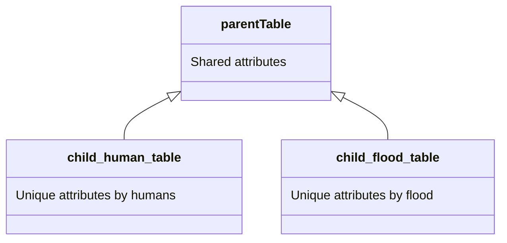

# Cosmonavt Database

This is the full cosmonavt db guide, it is a 90% normalized (up to NF3) db with a 10% des-normalize structure due to
project requirement (aka only use mysql as storage).

For production a not relational db or even in memory cached one
would be used to store des-normalize tables, optimizing performance.

> NOTE: Many des-normalize tables present an `x` and `y` fields used to query layout and chunk data, for performance
> reasons these are indexed, enabling faster queries.

## Engine

The engine selection criteria for each table in this database is based on two key indicators,
performance and integrity. That take us to why most of the tables are using `InnoDB`, it performances great on most
CRUD operations and enforces data integrity, most of the tables in this schema are linked to each other.
Only certain des-normalize tables used `MyISAM` where reads will be the primary or even the only operation,
therefore maintaining data integrity is easier, guarantying the best performance and security.

## Relation

As on the game dynamics, many aspects of each game (human / flood) are shared across tables as well; that's why we
have chosen to use an inherited layout, meaning this pattern can often be found in our schema:

Maintaining data integrity and optimizing storage.

## Types

There are many types across tables, all representing a different finite set, that's why we decide to use
enums to store these types and enhance performance and scalability

> NOTE: Not all types are yet decided because we depend on factors such as map's layout creation to assign types.

## Charset

We used utf8mb4 because it is the most complete and future-proof character set for MySQL. Unlike the older `utf8`, which
only supports up to 3 bytes per character (therefor cannot store many Unicode symbols, such as emojis or certain Asian
scripts), `utf8mb4` supports the full range of Unicode characters using up to 4 bytes per character. This ensures that
all user input, including international text and special symbols, can be stored and retrieved without data loss or
corruption. Using `utf8mb4` also helps prevent unexpected errors when handling multilingual content or data from modern
devices and platforms. And because we are precenting a model as scalable we could create, we consider it's the best 
choice.
