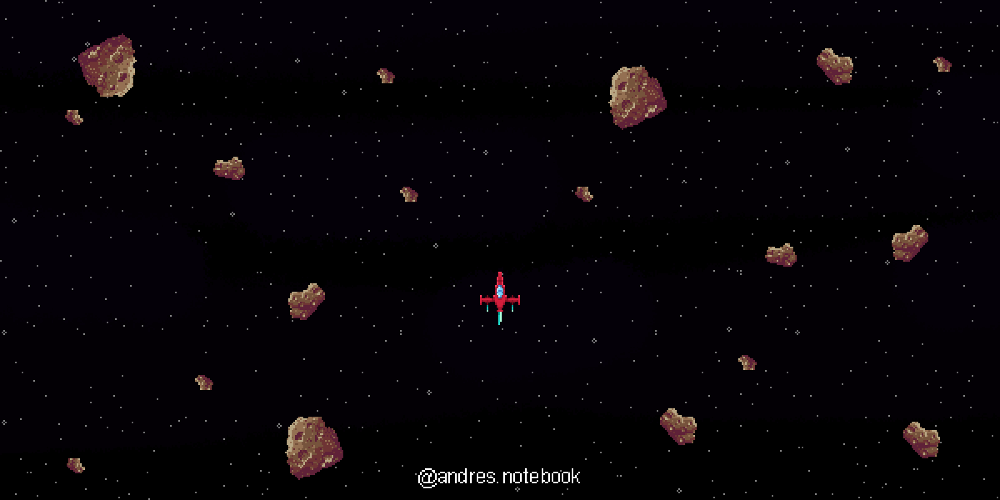
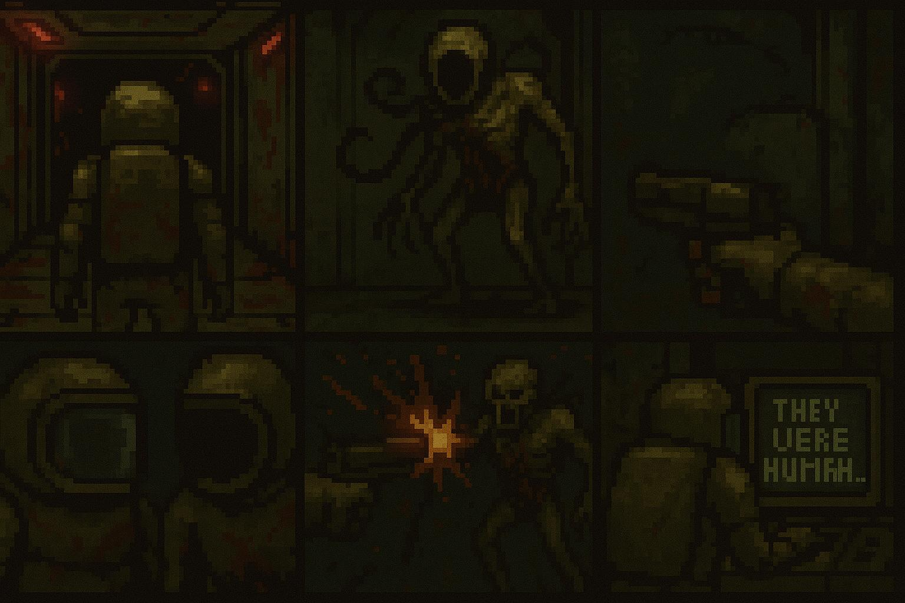
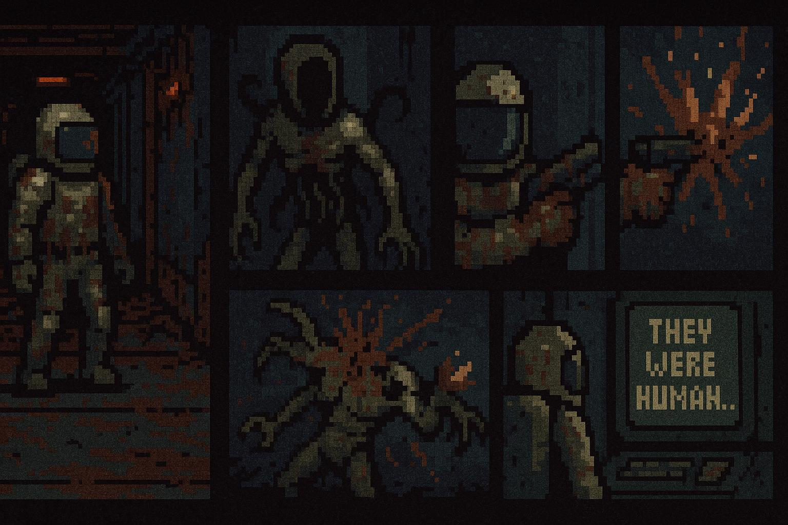
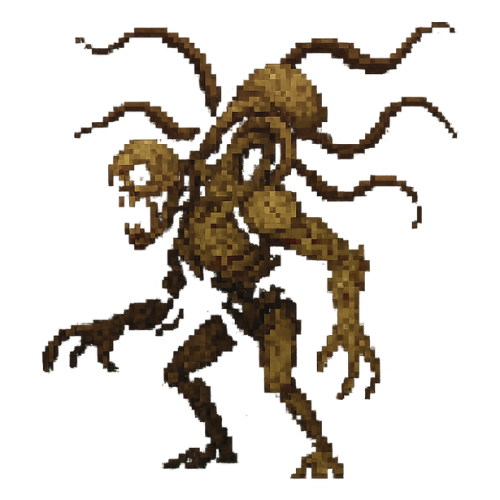
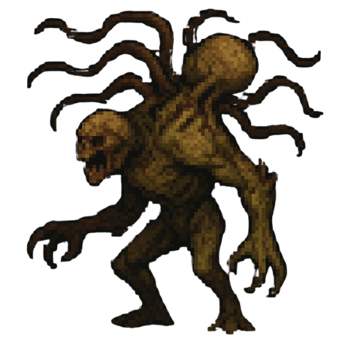
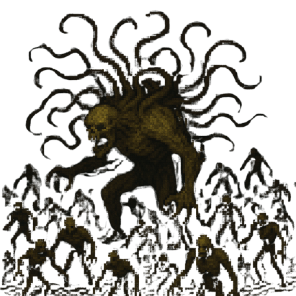
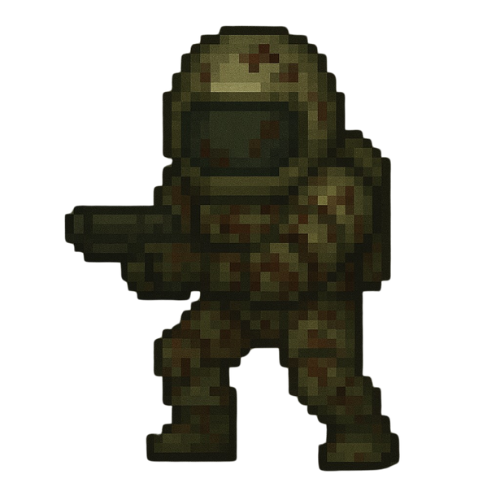
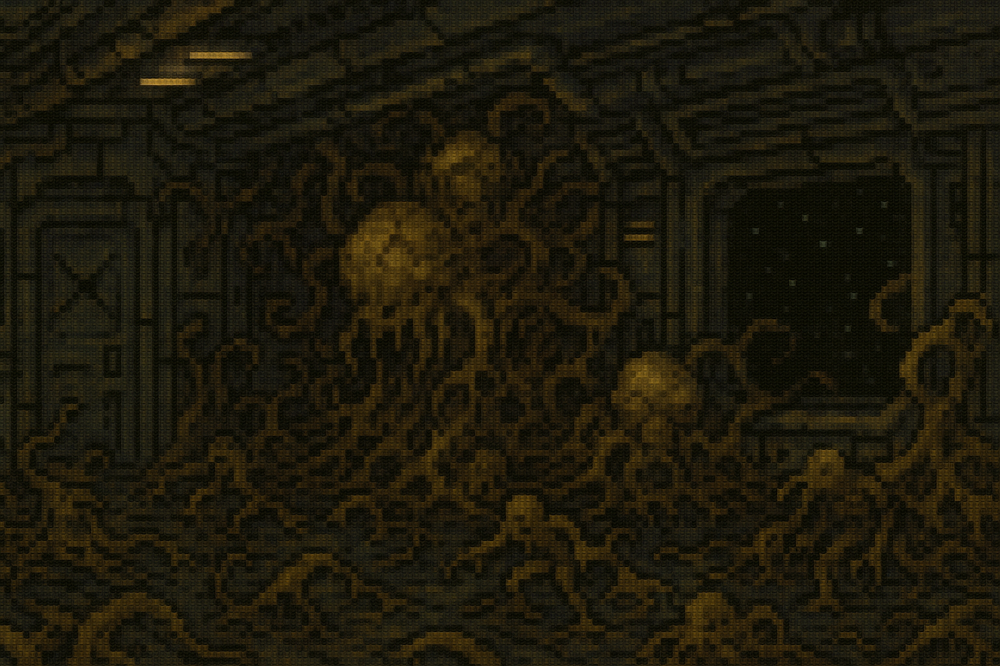

# **Cosmonavt: The Flood Edition** _Documento de Diseño de Juego_

### **Cosmonavt © MAAN STUDIOS Todos los derechos reservados.**
**Por Mariano Carretero, Isabela Valls, Hans Preinfalk**

## _Index_

1. [Idea del Juego](#idea-del-juego)
2. [Game Design](#game-design)
    1. [Summary](#summary)
        1. [Story](#story)
    2. [Gameplay](#gameplay)
    3. [Mindset](#mindset)
3. [Technical](#technical)
    1. [Screens](#screens)
    2. [Controls](#controls)
    3. [Mechanics](#mechanics)
    4. [Tecnologías](#tecnologías)
4. [Level Design](#level-design)
    1. [Themes](#themes)
    2. [Game Flow](#game-flow)
5. [Development](#development)
    1. [Abstract Classes](#abstract-classes--components)
    2. [Derived Classes](#derived-classes--component-compositions)
    3. [Listado de Clases a Programar](#listado-de-clases-a-programar)
6. [Graphics](#graphics)
    1. [Style Attributes](#style-attributes)
    2. [Graphics Needed](#graphics-needed)
7. [Sounds / Music](#sounds--music)
    1. [Style Attributes](#style-attributes-1)
    2. [Sounds Needed](#sounds-needed)
    3. [Music Needed](#music-needed)
8. [Assets Requeridos](#assets-requeridos)
9. [Ilustraciones](#ilustrations)

## _Idea del Juego_

Cosmonavt: The Flood Edition es un juego roguelite top-down sci-fi de horror donde el jugador encarna a un ser alienígena (Flood) con inteligencia superior que debe infiltrarse en instalaciones espaciales para encontrar y destruir una cura que amenaza a su especie. El juego invierte la fórmula tradicional del género survival horror al colocar al jugador en el rol del "monstruo", mientras explora estaciones espaciales, combate humanos, absorbe su conocimiento y biomasa, y evoluciona para volverse más poderoso.

El jugador debe gestionar estratégicamente su biomasa como recurso principal para curarse, crear clones y evolucionar, mientras busca tres fragmentos clave de información que revelarán la ubicación de la cura. La inteligencia artificial de los NPCs humanos está basada en un autómata finito con estados definidos que reaccionan de manera diferente según las acciones del jugador, creando un entorno dinámico y desafiante.

El juego ofrece multijugador cooperativo exclusivamente entre jugadores Flood, donde pueden coordinar estrategias para superar las defensas humanas más eficientemente. A diferencia de la versión humana de Cosmonavt, esta edición se enfoca en la perspectiva Flood, ofreciendo una experiencia única de caza, evolución y estrategia.

## _Game Design_

---

### **Summary**

Cosmonavt: The Flood Edition es un roguelite de acción sci-fi con perspectiva top-down. Como una entidad Flood inteligente, tu objetivo es encontrar y destruir la cura antes de que los humanos puedan desarrollarla. Explorarás estaciones espaciales abandonadas y naves, absorbiendo el conocimiento de los humanos eliminados para expandir tus capacidades y descubrir pistas sobre la ubicación de la cura. Esta versión se centra exclusivamente en la experiencia Flood, con soporte multijugador para juego cooperativo solo entre jugadores Flood.

#### Story

Una entidad alienígena (el Flood) evolucionó en el vacío del espacio tras ser expuesta a la radiación de un agujero negro. Esta forma de vida logró infiltrarse en una estación espacial humana, iniciando una infestación que se propagó rápidamente.

Como un Flood primario, has absorbido el conocimiento de un científico de alto rango y has desarrollado inteligencia superior y autoconciencia. A diferencia de otros Flood, comprendes que los humanos supervivientes están trabajando en una cura que podría erradicar a toda tu especie. Tu misión es clara: encontrar la cura antes que ellos y destruirla.

La información sobre la cura está dispersa entre diferentes científicos y ubicaciones. Cada humano que asimilas te proporciona parte de sus conocimientos, acercándote a tu objetivo. Debes navegar a través de entornos generados proceduralmente, evolucionando tus capacidades y duplicándote para aumentar tus posibilidades de éxito.

### **Gameplay**

Como el Flood, exploras entornos mientras buscas humanos para absorber su conocimiento y obtener biomasa. Cada humano eliminado te proporciona biomasa para evolucionar y, si es un científico o personal importante, información vital sobre la cura. El mundo se genera proceduralmente, creando una experiencia única en cada partida.

El objetivo principal es encontrar los tres fragmentos de información necesarios para localizar la cura antes de que los humanos la desarrollen. Debes gestionar tu biomasa para desarrollar mejoras que te permitan acceder a nuevas áreas y superar las defensas humanas. La mecánica de clonación te permite crear nuevos Flood para expandir tu presencia, aunque cada clon requiere biomasa y tiene su propio cooldown.

El multijugador te permite formar equipo con otros jugadores Flood para el juego cooperativo, enfrentándose juntos a los NPC humanos y sus defensas.

### **Mindset**

Buscamos crear una experiencia de caza estratégica donde los jugadores Flood deben adaptarse constantemente para sobrevivir y cumplir su misión. La sensación debe ser de poder creciente con cada infección exitosa, con el desafío de tomar decisiones tácticas sobre cuándo atacar, cuándo clonarse y qué mejoras priorizar.

Queremos que los jugadores desarrollen estrategias de emboscada, infiltración y asalto directo, creando una experiencia de juego que alterne entre el sigilo calculado y los momentos de poder desatado. El jugador debe experimentar la satisfacción de absorber conocimiento y aumentar su biomasa, sintiendo cómo cada éxito lo acerca más a su objetivo.

## _Technical_

---

### **Screens**

#### Listado Estructurado de Pantallas

1. **Pantalla de Inicio**
   - Logo principal centrado
   - Botones de navegación: Jugar, Opciones, Créditos
   - Fondo animado con biomasa y ambiente espacial
   - Versión del juego

2. **Pantalla de Opciones**
   - Ajustes de sonido (volumen general, música, efectos)
   - Ajustes de idioma
   - Ajustes de brillo
   - Configuración de controles
   - Botón para volver al menú principal

3. **Pantalla de Selección de Modo**
   - Juego Individual
   - Multijugador
   - Tutorial
   - Botón para volver al menú principal

4. **Pantalla de Creación de Partida**
   - Selector de dificultad
   - Opciones público/privado
   - Campo para semilla personalizada
   - Herramientas para compartir código de invitación
   - Botón para iniciar partida

5. **Pantalla de Unirse a Partida**
   - Lista de partidas públicas disponibles
   - Campo para introducir código de partida privada
   - Filtros de búsqueda
   - Botón para unirse/volver

6. **HUD Principal de Juego**
   - Barra de salud
   - Indicador de biomasa
   - Contador de nivel de evolución
   - Indicador de habilidad seleccionada
   - Contador de clones activos
   - Fragmentos de conocimiento obtenidos
   - Indicadores de cooldown

7. **Pantalla de Pausa**
   - Opciones para continuar/guardar/salir
   - Acceso a objetivos actuales
   - Ajustes rápidos de opciones
   - Botones para gestión multijugador

8. **Pantalla de Diario de Conocimientos**
   - Fragmentos de información recolectados
   - Historial de descubrimientos
   - Pistas sobre objetivos
   - Botón para volver al juego

9. **Pantalla de Resultados Finales**
   - Estadísticas de partida (tiempo, muertes, asesinatos)
   - Tamaño final del ejército
   - Distancia recorrida
   - Fragmentos encontrados
   - Botones para nueva partida/volver al menú

10. **Pantalla de Mapa Espacial**
    - Vista de navegación entre ubicaciones
    - Marcadores de estaciones y naves
    - Información de estado para cada ubicación
    - Controles de navegación

### **Controls**

- Movimiento: WASD / Teclas de flecha
- Atacar: Click izquierdo (dirigido con el ratón)
- Agarrar/Interactuar: E
- Habilidad especial (Clonación): Q
- Cambiar ataque: R
- Sprint: Shift
- Comunicación: C (chat de texto)
- Menú de Pausa: Espacio

### **Mechanics**

#### Sistema de Combate

El Flood puede llevar hasta 2 tipos de ataque activos al mismo tiempo, alternados con la tecla R y ejecutados con el botón izquierdo del ratón. Los ataques se dirigen hacia el cursor del ratón. Esta limitación obliga a tomar decisiones estratégicas según la situación de combate.

**Valores detallados de ataques:**
- **Golpe cuerpo a cuerpo:** 
  - Daño base: 10 puntos
  - Alcance: 1.5 tiles
  - Velocidad: 1 ataque cada 0.8 segundos
  - Sin cooldown específico

- **Vómito ácido:** 
  - Daño base: 5 puntos + 2 puntos/segundo durante 3s (total: 11 puntos)
  - Alcance: 3 tiles en cono de 30°
  - Efecto: Visión distorsionada para el objetivo durante 2s (reduce precisión 25%)
  - Cooldown: 2 segundos

- **Humo tóxico:** 
  - Daño: 0 (solo efectos de estado)
  - Alcance: Radio de 4 tiles
  - Efecto: Ralentiza a los humanos un 30% durante 5s
  - Persistencia: La nube permanece activa 4 segundos
  - Cooldown: 6 segundos

- **Lanzamiento de espinas:** 
  - Daño base: 20 puntos
  - Alcance: 6 tiles en línea recta
  - Velocidad del proyectil: 8 tiles/segundo
  - Cooldown: 4 segundos

**Sistema de daño**:
- Los humanos normales tienen 100 HP (Científicos), 150 HP (Ingenieros) o 200 HP (Soldados)
- La armadura reduce el daño recibido en un porcentaje fijo (15-30% según el tipo)
- Fórmula de daño: `Daño_Final = Daño_Base * (1 - %Armadura) * Multiplicador_Evolución`
- Multiplicador de evolución: Nivel 1 = 1.0x, Nivel 2 = 1.25x, Nivel 3 = 1.5x

#### Sistema de IA para NPCs

Los NPCs son controlados por un autómata complejo que responde a diversos inputs que provocan cambios de estado. Cada NPC puede estar en uno de los siguientes estados:

- **Rest**: Estado de descanso, salud completa, permanece en un punto.
- **Patrolling**: Patrullando el mapa, moviéndose entre puntos predefinidos.
- **Attacking**: Persiguiendo y atacando al jugador.
- **Stunned**: Aturdido temporalmente (3 segundos), no puede moverse.
- **Run**: Huyendo del jugador, su salud se regenera lentamente (1% por segundo).

Los inputs que provocan transiciones entre estados son:
1. Recibir daño → Transición según tabla
2. Colisión con Jugador → Transición según tabla
3. Detectar Jugador → Transición según tabla
4. Vida IA < 10 → Generalmente cambia a estado Run
5. Recibir daño > 55 → Generalmente cambia a estado Stunned
6. Jugador Cerquita (Zona de peligro) → Transición según tabla
7. Vida IA > 50 → Transición según tabla
8. Matar jugador → Transición según tabla

La tabla de transiciones determina el nuevo estado según el estado actual y el input recibido. Por ejemplo, si un NPC está en estado Rest y recibe el input 3 (Detectar Jugador), cambiará a estado Attacking.

**Tabla de transiciones ejemplo**:
- Rest + Input 1 (Recibir daño) → Attacking
- Rest + Input 3 (Detectar Jugador) → Attacking
- Patrolling + Input 2 (Colisión Jugador) → Attacking
- Patrolling + Input 3 (Detectar Jugador) → Attacking
- Attacking + Input 4 (Vida < 10%) → Run
- Attacking + Input 5 (Daño > 55) → Stunned
- Stunned + [Después de 3s] → Attacking o Run (según salud)
- Run + Input 7 (Vida > 50%) → Patrolling

#### Absorción y Clonación

**Sistema de Infección**  
El Flood puede infectar humanos a través de ataques cuerpo a cuerpo o a distancia. Al eliminar a un humano, obtienes biomasa que puedes utilizar para curarte, clonarte o evolucionar.

**Valores detallados de infección**:
- Tiempo de infección: 1.5 segundos tras eliminar al humano
- Radio de recolección automática: 2 tiles

**Clonación con Cooldown**  
Al activar la habilidad especial (Q), consumes 1 biomasa y después de 5 segundos generas un clon con 50% de salud. Este proceso requiere estar quieto y si es interrumpido, debe reiniciarse. La clonación tiene su propio cooldown.

**Valores detallados de clonación**:
- Tiempo de canalización: 5 segundos exactos
- Consumo de biomasa: 1 unidad por clon
- Salud del clon: 50% de la salud actual del jugador
- Cooldown después de clonar: 30 segundos
- Límite de clones simultáneos: 3 (base), 5 (con evolución completa)

**Absorción de Conocimiento**  
Al infectar humanos, especialmente científicos, obtienes fragmentos de información sobre la cura. La calidad y cantidad de información varía según el rol del humano, siendo los científicos los más valiosos para tu objetivo.

**Probabilidades de fragmentos**:
- Científico: 80% fragmento básico, 30% fragmento clave
- Ingeniero: 40% fragmento básico, 5% fragmento clave
- Soldado: 10% fragmento básico, 0% fragmento clave

**Biomasa como Recurso Principal**  
La biomasa obtenida de humanos y recursos orgánicos es la moneda para desbloquear mejoras. Los valores de biomasa varían por tipo:
- Civil/científico: 1 biomasa
- Militar: 2 biomasa

La biomasa puede usarse para:
- Curarse (+15 HP por unidad)
- Crear clones (1 biomasa por clon)
- Evolucionar (requiere 3 cadáveres humanos + 3 biomasa para nivel 2, 5 cadáveres + 5 biomasa para nivel 3)

**Limitaciones de biomasa**:
- Capacidad máxima nivel 1: 10 unidades
- Capacidad máxima nivel 2: 15 unidades
- Capacidad máxima nivel 3: 20 unidades

#### Mejoras y Evolución

La evolución del Flood se activa después de consumir cadáveres humanos y biomasa, subiendo de nivel y otorgando mejoras permanentes. Las evoluciones aumentan tus capacidades ofensivas, defensivas o de sigilo.

**Valores detallados de evolución**:
- Nivel 1 → 2: +25% daño, +25 HP, +2 capacidad máxima de biomasa
- Nivel 2 → 3: +25% daño adicional (total +50%), +25 HP adicionales, +5 capacidad máxima de biomasa

Conforme evolucionas, tu apariencia física cambia, volviéndote más grande y con nuevas características visuales que reflejan tu poder creciente.

#### Sentidos Mejorados y Visión

**Percepción Flood**  
El Flood tiene mejor visión distinta a la de un humano, es más oscura y grotesca.

**Características específicas de visión**:
- Filtro visual: Tonos verdosos/púrpuras, mayor contraste
- Detección de calor: Los humanos destacan ligeramente (solo textura)
- Obstrucción por obstáculos sólidos: Visibilidad bloqueada completamente

#### Resistencia y Habilidades Especiales

**Sprint**  
El Flood puede esprintar (tecla Shift) durante 4 segundos con un cooldown de 8 segundos.

**Valores detallados de sprint**:
- Velocidad normal: 5 tiles/segundo
- Velocidad sprint: 8 tiles/segundo
- Duración: 4 segundos exactos
- Cooldown: 8 segundos (comienza tras finalizar el sprint)
- Cancelación: No se puede cancelar una vez iniciado

**Clonación (habilidad Q)**  
Requiere estar quieto, consume 1 biomasa, tarda 5 segundos y genera un clon con 50% de HP. Si se interrumpe, el proceso se reinicia.

### **Tecnologías**

El desarrollo de Cosmonavt: The Flood Edition se realizará utilizando las siguientes tecnologías:

#### Frontend
- **HTML5/CSS3**: Para la estructura básica y estilos de la interfaz
- **JavaScript**: Como lenguaje principal de programación
- **Canvas API**: Para el renderizado del juego
- **Vite**: Como herramienta de construcción y servidor de desarrollo, facilitando la modularización y optimización del código

#### Backend
- **Node.js**: Como entorno de ejecución para el servidor
- **Express.js**: Framework para la creación de APIs RESTful y manejo de rutas
- **Socket.IO**: Para la comunicación en tiempo real necesaria para el multijugador
- **MySQL**: Como base de datos para almacenar información de usuarios, partidas y estadísticas

#### Control de Versiones
- **Git**: Para el control de versiones y trabajo colaborativo
- **GitHub**: Para el alojamiento del repositorio y gestión del proyecto

El juego está diseñado para funcionar principalmente en navegadores modernos, con optimización para Chrome, Firefox y Edge. La arquitectura permitirá una clara separación entre lógica de juego, renderizado y comunicación de red, facilitando el mantenimiento y la ampliación futura.

## _Level Design_

### **Themes**

#### 1. Estación Espacial Contaminada

**Ambiente:**  
Pasillos metálicos parcialmente cubiertos de biomasa orgánica, luces fallando, áreas selladas por crecimiento Flood.

**Narrativa:**  
Tu primera zona de expansión. El objetivo es infectar áreas críticas y encontrar el primer fragmento de conocimiento sobre la cura.

**Jugabilidad:**
- Perfecto para aprender mecánicas básicas de infección.
- Múltiples rutas para flanquear posiciones defendidas.
- Científicos con los primeros fragmentos clave sobre la cura.
- Áreas con condiciones de luz variables que afectan tu percepción.

#### 2. Nave de Evacuación

**Ambiente:**  
Espacios confinados, sistemas de descontaminación activos, humanos armados en constante movimiento.

**Narrativa:**  
Humanos intentando escapar con información crítica. Tu objetivo es interceptarlos y absorber sus conocimientos.

**Jugabilidad:**
- Entorno dinámico con sistemas de purga que los humanos pueden activar.
- Rutas de escape que necesitarás bloquear.
- Objetivo de sabotaje: impedir que la nave sea reparada y pueda despegar.

#### 3. Estación de Investigación Orbital

**Ambiente:**  
Módulos científicos de alta tecnología, áreas de cuarentena, sistemas de seguridad avanzados.

**Narrativa:**  
Un centro de investigación donde se estudian muestras del Flood y se desarrollan posibles componentes para la cura.

**Jugabilidad:**
- Sistemas de seguridad complejos que debes desactivar.
- Áreas de contención que limitan temporalmente tus habilidades.
- Científicos de alto nivel con información valiosa para tu misión.
- Retos basados en infiltración más que en combate directo.

#### 4. Laboratorio Central

**Ambiente:**  
Instalación high-tech, sistemas de contención biológica, iluminación brillante que dificulta el sigilo, defensas avanzadas.

**Narrativa:**  
El centro de investigación donde los humanos desarrollan la cura. Tu objetivo final es encontrar el prototipo y destruirlo.

**Jugabilidad:**
- Zona de máxima seguridad con trampas y defensas.
- Científicos protegidos por escoltas de soldados NPCs.
- Confrontación final que requiere destruir componentes específicos.

### **Game Flow**

1. **Despertar como Flood inteligente**  
   Emerges con conciencia tras absorber a un científico, descubriendo tu misión de encontrar la cura.

2. **Tutorial básico**  
   Aprendes a moverte, atacar y absorber humanos.

3. **Primer fragmento de conocimiento**  
   Al eliminar a un científico, obtienes el primer fragmento de información sobre la cura.

4. **Expansión inicial**  
   Comienzas a explorar la estación espacial, acumulando biomasa y evolucionando capacidades básicas.

5. **Descubrir nuevas áreas**  
   Los fragmentos de conocimiento revelan la ubicación de nuevas zonas donde buscar más información.

6. **Dominar la clonación**  
   Aprendes a usar la biomasa para crear clones y expandir tu presencia.

7. **Evolución**  
   Tu Flood crece y se fortalece, desarrollando nuevas capacidades ofensivas.

8. **Carrera por los componentes**  
   Compites con humanos NPCs para encontrar componentes físicos de la cura.

9. **Confrontación con especialistas humanos**  
   NPCs con roles específicos (soldados con armas anti-Flood, ingenieros con trampas) presentan desafíos únicos.

10. **Sabotaje estratégico**  
    Interrumpes los esfuerzos humanos dañando equipamiento o bloqueando rutas clave.

11. **Descubrimiento del laboratorio central**  
    Localizas el centro donde los científicos humanos están completando la cura.

12. **Confrontación final**  
    Te enfrentas a los últimos defensores humanos protegiendo el prototipo de la cura.

13. **Victoria o derrota**  
    Si destruyes la cura, garantizas la supervivencia de los Flood. Si los humanos la completan, tu especie está condenada.

## _Development_

El sistema de clases en *Cosmonavt: The Flood Edition* utiliza una arquitectura basada en componentes según lo especificado en los requisitos técnicos. Las clases base y sus relaciones se definen a continuación.

### **Abstract Classes / Components**

```mermaid
classDiagram
    class GameObject {
        +Vector position
        +number width
        +number height
        +string sprite
        +Hitbox hitbox
        +update(dt)
        +draw(ctx)
        +collidesWith(other)
        +onDestroy()
        +isVisible(viewport)
        +serialize()
    }

    class FloodBase {
        +number biomass
        +number evolution
        +number cloneCooldown
        +infectHuman(human)
        +createClone()
    }

    class HumanNPC {
        +number health
        +number oxygen
        +HumanRole role
        +Equipment[] equipment
        +resistInfection()
        +useEquipment()
        +NPCState currentState
        +updateState()
        +transition(newState)
    }

    class ObjectMap {
        +GameObject[][] tiles
        +GameObject[] entities
        +BiomassZone[][] infectedzones
        +string seed
        +generate()
        +loadFromSeed(seed)
        +updateEntityPositions()
    }

    class KnowledgeFragment {
        +string content
        +number importance
        +KnowledgeType type
        +reveal()
    }

    class Vector {
        +number x
        +number y
        +add(vector)
        +sub(vector)
        +scale(factor)
        +length()
        +normalize()
        +dot(vector)
    }

    class Hitbox {
        +number x
        +number y
        +number width
        +number height
        +number offsetX
        +number offsetY
        +boolean isPhysical
        +boolean isLogical
        +intersects(hitbox)
        +contains(point)
        +moveTo(x, y)
        +drawDebug(ctx)
    }

    class ObjectItem {
        +ItemType type
        +use(player)
        +Hitbox proximityBox
    }

    class ObjectStructure {
        +boolean isBlocking
        +boolean isDestructible
        +animate()
        +damage(amount)
    }

    class NPCState {
        <<enumeration>>
        REST
        PATROLLING
        ATTACKING
        STUNNED
        RUN
    }

    GameObject <|-- FloodBase
    GameObject <|-- HumanNPC
    GameObject <|-- KnowledgeFragment
    GameObject <|-- ObjectItem
    GameObject <|-- ObjectStructure
    GameObject *-- Hitbox
    GameObject *-- Vector
    ObjectMap *-- GameObject
```

### **Listado de Clases a Programar**

A continuación se presenta un listado detallado de las clases que deben ser implementadas, organizadas por categoría y con descripción de sus responsabilidades:

#### Clases Núcleo

1. **Game**
   - Responsabilidad: Punto de entrada principal, gestión de ciclo de juego y estados
   - Métodos principales: initialize(), update(), render(), changeState()

2. **GameState**
   - Responsabilidad: Clase abstracta para diferentes estados del juego
   - Subclases: MenuState, PlayState, PauseState, GameOverState

3. **AssetManager**
   - Responsabilidad: Carga y gestión centralizada de recursos (imágenes, sonidos)
   - Métodos principales: loadImage(), loadSound(), getImage(), getSound()

4. **InputManager**
   - Responsabilidad: Captura y procesamiento de entradas de usuario
   - Métodos principales: update(), isKeyDown(), isMouseButtonDown(), getMousePosition()

#### Clases de Entidades

5. **GameObject**
   - Responsabilidad: Clase base para todos los objetos del juego
   - Métodos principales: update(), render(), collidesWith()

6. **FloodPlayer**
   - Responsabilidad: Protagonista controlado por el usuario
   - Métodos principales: movePlayer(), attack(), absorb(), createClone(), evolve()

7. **FloodClone**
   - Responsabilidad: Clones creados por el jugador, controlados por IA
   - Métodos principales: followPlayer(), attackNearbyHumans(), isDead()

8. **HumanNPC**
   - Responsabilidad: NPCs humanos con diferentes roles
   - Métodos principales: updateState(), transition(), attackPlayer(), flee()

9. **Projectile**
   - Responsabilidad: Gestión de proyectiles en el juego (espinas, disparos)
   - Métodos principales: update(), checkCollision(), applyEffect()

#### Clases de Mapa y Entorno

10. **LevelGenerator**
    - Responsabilidad: Generación procedural de niveles
    - Métodos principales: generateLevel(), createRooms(), connectRooms()

11. **TileMap**
    - Responsabilidad: Representación y renderizado del mapa de tiles
    - Métodos principales: render(), getTileAt(), isWalkable()

12. **Room**
    - Responsabilidad: Definición y gestión de habitaciones dentro del nivel
    - Métodos principales: generate(), populateWithEntities(), connectTo()

13. **BiomassSystem**
    - Responsabilidad: Gestión de la propagación de biomasa en el entorno
    - Métodos principales: update(), infect(), getInfectionLevel()

#### Clases de UI

14. **UIManager**
    - Responsabilidad: Gestión de interfaces de usuario
    - Métodos principales: render(), update(), showDialog(), hideDialog()

15. **HUD**
    - Responsabilidad: Elementos de interfaz durante el juego
    - Métodos principales: renderHealthBar(), renderBiomassIndicator(), renderFragments()

16. **Menu**
    - Responsabilidad: Menús del juego (principal, pausa, opciones)
    - Métodos principales: render(), handleInput(), selectOption()

17. **DialogSystem**
    - Responsabilidad: Sistema de diálogos y narrativa
    - Métodos principales: showDialog(), advanceDialog(), hideDialog()

#### Clases de Sistema

18. **PhysicsSystem**
    - Responsabilidad: Gestión de colisiones y física
    - Métodos principales: update(), checkCollisions(), resolveCollision()

19. **ParticleSystem**
    - Responsabilidad: Efectos de partículas (sangre, ácido, humo)
    - Métodos principales: createParticleEffect(), update(), render()

20. **AudioSystem**
    - Responsabilidad: Reproducción y gestión de audio
    - Métodos principales: playSound(), playMusic(), setVolume()

21. **SaveSystem**
    - Responsabilidad: Guardado y carga de progreso
    - Métodos principales: saveGame(), loadGame(), exportSave()

#### Clases de Networking

22. **NetworkManager**
    - Responsabilidad: Gestión de comunicación multijugador
    - Métodos principales: connect(), disconnect(), sendData(), onReceiveData()

23. **LobbyManager**
    - Responsabilidad: Gestión de salas y emparejamiento
    - Métodos principales: createLobby(), joinLobby(), startGame()

24. **SyncManager**
    - Responsabilidad: Sincronización de estado entre clientes
    - Métodos principales: sync(), handleStateUpdate(), reconcile()

## _Graphics_

### **Style Attributes**

#### Estilo Visual General

*Cosmonavt: The Flood Edition* utiliza **pixel art de resolución media** con énfasis en la naturaleza orgánica y cambiante del Flood. Las unidades Flood son asimétricas, con animaciones que transmiten su naturaleza alienígena. El enfoque visual sigue siendo **semi-realista dentro de los límites del pixel art**, con énfasis en los efectos de corrupción ambiental.

#### Paleta de Colores

- **Tonos dominantes para el Flood:** verdes tóxicos, rojos orgánicos, púrpuras viscosos.
- **Biomasa:** texturas pulsantes con variaciones sutiles de color.
- **Contraste con humanos:** los humanos usan colores más metálicos y limpios, con variaciones según su rol (científicos, soldados, ingenieros).

#### Interfaces

- **HUD simple:** indicadores claros de biomasa, salud y habilidades.
- **Visión del Flood:** ligeramente diferente en zonas oscuras vs. iluminadas.
- **Pantalla de clonación:** interfaz básica que muestra el progreso de creación de clones.

#### Feedback Visual

- **Infección exitosa:** partículas orgánicas, transformación del sprite humano.
- **Clonación:** animación simple de división.
- **Evolución:** cambios visuales en el sprite del Flood, haciéndolo más grande y amenazante.
- **Detección de humanos:** indicadores visuales sutiles de presencia humana cercana.

### **Graphics Needed (Pixel Art)**

#### Personajes

- **Flood:** varias etapas de evolución, con sprites para movimiento, ataque, infección.
- **Humanos (NPCs):** científicos, soldados, ingenieros, cada uno con animaciones básicas.
- **Evoluciones visibles:** cambios de tamaño y forma en el sprite del Flood.

#### Entornos

- **Biomasa:** tiles que muestran diferentes niveles de contaminación Flood.
- **Sistemas de purificación:** dispositivos que los humanos pueden activar.
- **Zonas de investigación:** laboratorios y equipos científicos.
- **Trampas y defensas:** obstáculos típicos en escenarios.

#### HUD

- Indicadores de salud, biomasa y cooldowns.
- Fragmentos de conocimiento recolectados.
- Contador de clones creados.

#### Objetos

- Mejoras: representaciones visuales de las capacidades que puedes desarrollar.
- Fragmentos de conocimiento: dispositivos de datos o notas conteniendo información.
- Equipamiento humano anti-Flood: armas, trampas y herramientas.
- Componentes de la cura: objetos físicos que debes encontrar y destruir.

## _Sounds / Music_

### **Style Attributes**

#### Música

- Música **orgánica y perturbadora**, con elementos húmedos y pulsantes.
- Combinación de **texturas biomecánicas** con **disonancias crecientes**.
- Transiciones musicales según el nivel de tensión y combate.

#### Sonido

- Efectos orgánicos: viscosos, chirriantes, pulsantes.
- Contraste entre sonidos biológicos del Flood y tecnológicos de los humanos.
- Indicadores sonoros para detectar actividad humana cercana.

### **Sounds Needed**

#### Acciones del Flood

- Movimiento: sonidos húmedos, arrastre orgánico
- Infección: burbujeante, transformación dolorosa
- Clonación: sonido viscoso de división
- Evolución: metamorfosis orgánica, crujidos
- Ataques: ácido, golpes, espinas

#### Humanos y Entorno

- Acciones de humanos NPCs: pasos, comunicaciones, manipulación de equipos
- Equipamiento anti-Flood: fuego, purificación
- Sistemas de alerta: alarmas, cierres de emergencia
- Hallazgos de conocimiento: sonido distintivo de descubrimiento
- Trampas activándose: sonidos según el tipo

### **Music Needed**

| Situación             | Estilo musical sugerido                                    |
|-----------------------|------------------------------------------------------------|
| Exploración           | Pulsos lentos, tensión creciente, notas graves             |
| Caza activa           | Ritmos acelerados, capas sónicas superpuestas              |
| Confrontación         | Texturas disonantes, percusión intensa                     |
| Descubrimiento        | Revelación sonora, curiosidad alienígena                   |
| Evolución             | Transiciones tonales, transformación sonora                |
| Victoria Flood        | Triunfo perturbador, satisfacción alienígena               |
| Derrota Flood         | Desintegración sonora, final amargo                        |
| Tema principal        | Synth ambiental, notas lentas, arpegios en menor           |
| Nave infectada        | Pads disonantes, samples orgánicos, ritmo débil            |
| Espacio abierto       | Silencio con ecos, loops ambientales con distorsión        |
| Combate               | Chiptune agresivo + percusión digital, loops tensos        |
| Créditos finales      | Piano digital, sintetizador melancólico                    |

## _Assets Requeridos_

### Personajes

#### Flood (Jugables y NPCs) - PRIORIDAD ALTA
1. **Flood Base**: Sprite principal con 4 direcciones, 4 frames de animación por dirección mínimo
2. **Flood Evolucionado Nivel 1**: Versión más grande y amenazante, 4 direcciones, 4 frames mínimo
3. **Flood Evolucionado Nivel 2**: Versión final, con apéndices adicionales, 8 direcciones, 4 frames mínimo
4. **Animación de Clonación**: 4 frames mostrando el proceso de división

#### Humanos NPCs - PRIORIDAD ALTA
1. **Científico**: 4 direcciones, 4 frames de animación mínimo(caminando, corriendo, atacando, muriendo)
2. **Soldado**: 4 direcciones, 4 frames de animación (con variantes para diferentes armas)
3. **Ingeniero**: 4 direcciones, 4 frames de animación
4. **Animación de Muerte/Infección**: 4 frames mostrando transformación al ser infectado

### Entorno Espacial

#### Mapa de Navegación Espacial - PRIORIDAD MEDIA
1. **Fondo espacial**: Textura base con estrellas y nebulosas (tileable)
2. **Planetas distantes**: 5-8 variantes de planetas como elementos decorativos
3. **Estrellas y nebulosas**: Efectos de partículas y elementos decorativos
4. **Iconos de estaciones**: Marcadores para las 4 ubicaciones principales

#### Estaciones Espaciales y Naves - PRIORIDAD ALTA
1. **Tiles de piso metálico**: 5 variantes básicas mínimo (limpio, sucio, dañado)
2. **Tiles de pared**: 4 variantes mínimo (metálicas, con ventanas, con daños)
3. **Tiles de biomasa**: 4 variantes que muestran diferentes niveles de infestación
4. **Puertas y escotillas**: 3 variantes (cerrada, abierta, bloqueada, destruida)
5. **Consolas y paneles**: 3 variantes
6. **Generadores y maquinaria**: 3 elementos decorativos/interactivos
7. **Luces y sistemas eléctricos**: 3 variantes (funcionando, dañados, apagados)
8. **Laboratorios**: 4 elementos (tubos de ensayo, microscopios, etc.)

### Efectos de Ataque y Habilidades - PRIORIDAD ALTA

1. **Vómito ácido**: Animación de 4 frames, efecto de salpicadura
2. **Humo tóxico**: Partículas y efecto de nube, 4 frames
3. **Lanzamiento de espinas**: Proyectil y efecto de impacto, 4 frames
4. **Golpe cuerpo a cuerpo**: Animación de ataque, 4 frames
5. **Efecto de evolución**: Partículas y transformación, 8 frames
6. **Efecto de sprint**: Estela o rastro, 3 frames

### Interfaz de Usuario - PRIORIDAD MEDIA

1. **Barra de salud**: Indicador con 3 estados (lleno, medio, crítico)
2. **Indicador de biomasa**: Medidor orgánico con efecto pulsante
3. **Iconos de habilidades**: 4 iconos distintos para los diferentes ataques
4. **Marcador de cooldown**: Animación circular o de barra para tiempos de recarga
5. **Contador de clones**: Icono simple con número asociado
6. **Fragmentos de conocimiento**: 3 iconos distintos para cada tipo de fragmento
7. **Botones de menú**: 8 variantes para diferentes funciones
8. **Efecto de visión Flood**: Filtro o shader que altera la percepción del mundo

### Objetos e Ítems - PRIORIDAD MEDIA

1. **Biomasa recolectable**: 3 variantes visuales
2. **Fragmentos de conocimiento**: 3 tipos distintos (dispositivos, notas, muestras)
3. **Componentes de la cura**: 3 piezas únicas que deben ser destruidas
4. **Armas de NPCs**: 4 tipos diferentes (pistola, metralleta, granadas, lanzallamas)
5. **Sistemas de purificación**: 2 variantes (activo, inactivo)
6. **Trampas**: 4 tipos diferentes (láser, campo de fuerza, gas, mecánica)

### Efectos Visuales Adicionales - PRIORIDAD BAJA

1. **Sangre y fluidos**: 5 variantes de salpicaduras y rastros
2. **Partículas de biomasa**: Efectos atmosféricos para zonas infectadas
3. **Iluminación**: Efectos de luz y sombra para linternas y sistemas de emergencia
4. **Efecto de aturdimiento**: Animación para NPCs en estado Stunned
5. **Niebla espacial**: Efecto ambiental para algunas áreas

### Menús y UI - PRIORIDAD ALTA

1. **Logo del juego**: Versión principal y variante para espacios reducidos
2. **Fondos de menú**: Un fondo
3. **Set de botones**: Conjunto completo para todas las interacciones de menú
4. **Iconos de navegación**: Flechas, indicadores, marcadores de objetivo

## _Ilustrations_

### Ejemplos de ilustraciones

1. **Espacio abierto**

    - Nave 

2. **Historia**

    - "Comic" 1: 
    - "Comic" 2: 

3. **Jugadores y entidades**

    - Flood nivel 1: 
    - Flood nivel 2: 
    - Flood nivel 3 con crias/clones: 
    - Humano soldado y todos sus variantes:
        - 
        - 
        - 
4. **Estaciones**
    - Boceto ultra básico 

